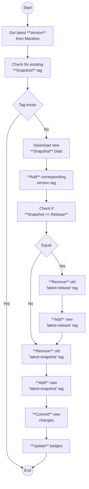

# Minecraft Default Data
[](https://github.com/Datapack-Registry/default/actions/workflows/generate_data.yml)
[](https://github.com/Datapack-Registry/default/tree/latest-release)
[](https://github.com/Datapack-Registry/default/tree/latest-snapshot)
[](https://github.com/Datapack-Registry/default/compare/latest-release...latest-snapshot)


This repository keeps track of Minecrafts generated default data for a datapack for every version since version [`17w43a`](https://minecraft.wiki/w/Java_Edition_17w43a). Every hour a check is made to see if there is a new Minecraft version. If a new version is available, it will be published on the [`generated`](https://github.com/Datapack-Registry/default/tree/generated) branch with the corresponding tag of the version.

Generated Assets can be found here: [Resourcepack-Registry/default](https://github.com/Resourcepack-Registry/default)

## Structure
Individual files can be viewed by the corresponding version tag:
```url
https://github.com/Datapack-Registry/default/blob/<version>/<path to file>?raw=true
```

Or to view the latest assets, there is a [`latest-release`](https://github.com/Datapack-Registry/default/tree/latest-release) and [`latest-snapshot`](https://github.com/Datapack-Registry/default/tree/latest-snapshot) tag:
```url
https://github.com/Datapack-Registry/default/blob/latest-release/<path to file>?raw=true

https://github.com/Datapack-Registry/default/blob/latest-snapshot/<path to file>?raw=true
```

## How it works


## Disclaimer
The purpose of this repository is **not** to "redistribute" Minecraft data! It should just simply serve as an easy and convenient way to view the differences between one version and another.

This repository assumes that because Mojang intentionally provides a public API for downloading the `client.jar`, they have no objection to the resulting generated assets existing anywhere on the internet for public consumption. If this assumption is ever contradicted, the repository will be removed immediately.
