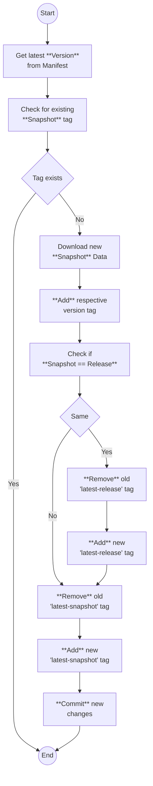

# Flowchart

```mermaid
flowchart TD
    START((Start))
    --> 
    A[Get latest **Version**<br>from Manifest]
    --> 
    B[Check for existing<br>**Snapshot** tag]
    -->
    TAG_EXISTS{Tag exists}
    -->
    |No| TAG_EXISTS_NO-A[Download new<br>**Snapshot** Data]
    -->
    TAG_EXISTS_NO-B[**Add** respective<br>version tag]
    -->
    TAG_EXISTS_NO-C[Check if<br>**Snapshot == Release**]
    -->
    TAG_EXISTS_NO-SAME{Same}
    -->
    |Yes| TAG_EXISTS_NO-SAME_YES-A[**Remove** old<br>'latest-release' tag]
    -->
    TAG_EXISTS_NO-SAME_YES-B[**Add** new<br>'latest-release' tag]
    
    TAG_EXISTS_NO-SAME
    -->
    |No| TAG_EXISTS_NO-D[**Remove** old<br>'latest-release' tag]
    
    TAG_EXISTS_NO-SAME_YES-B
    -->
    TAG_EXISTS_NO-D

    TAG_EXISTS_NO-D[**Remove** old<br>'latest-snapshot' tag]
    -->
    TAG_EXISTS_NO-E[**Add** new<br>'latest-snapshot' tag]
    -->
    TAG_EXISTS_NO-F[**Commit** new<br>changes]

    TAG_EXISTS
    -->
    |Yes| END

    TAG_EXISTS_NO-F
    -->
    END((End))
```
